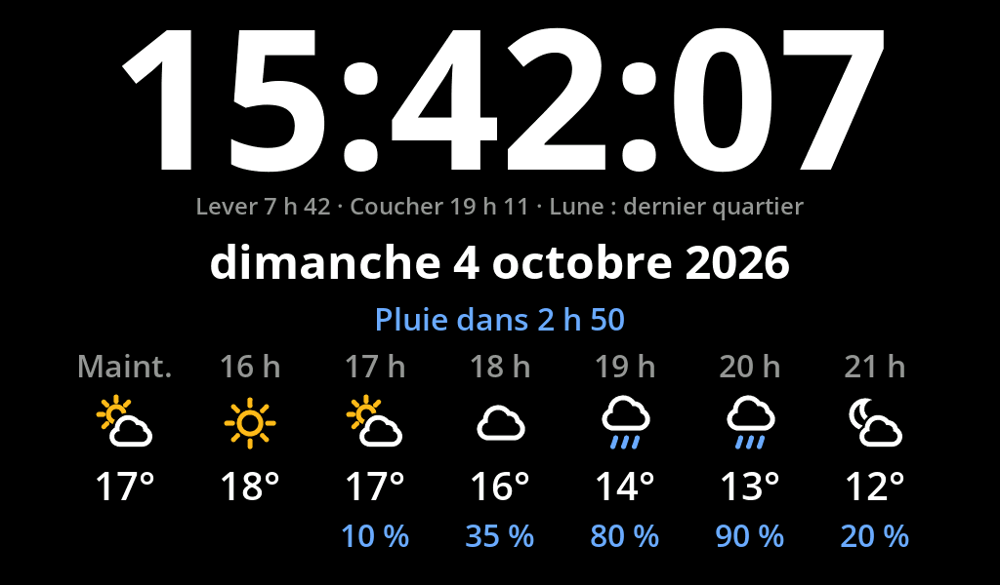
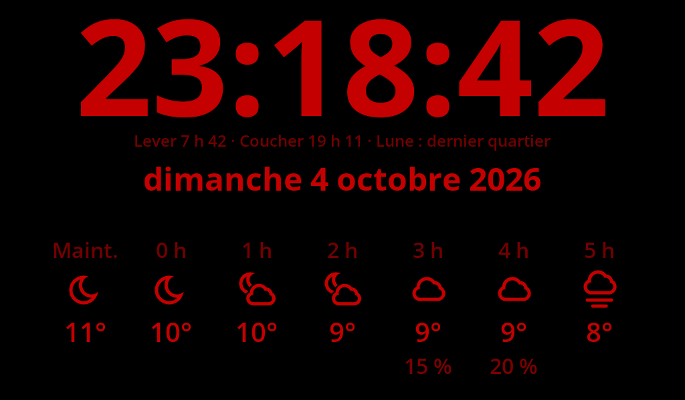
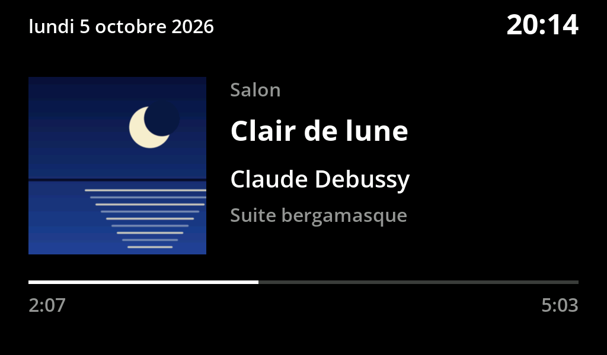
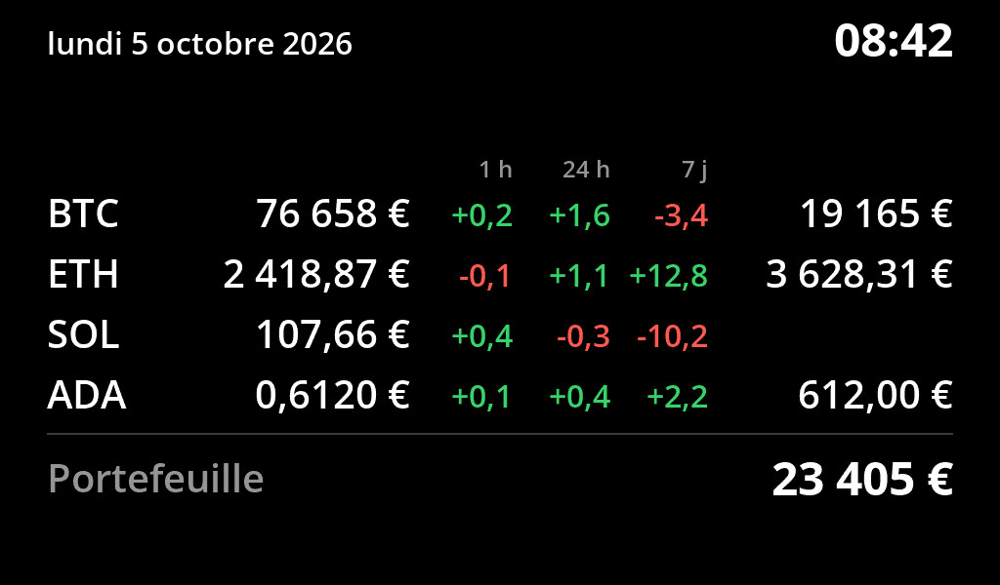
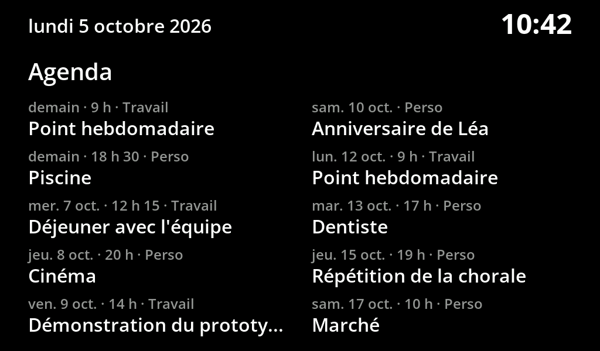
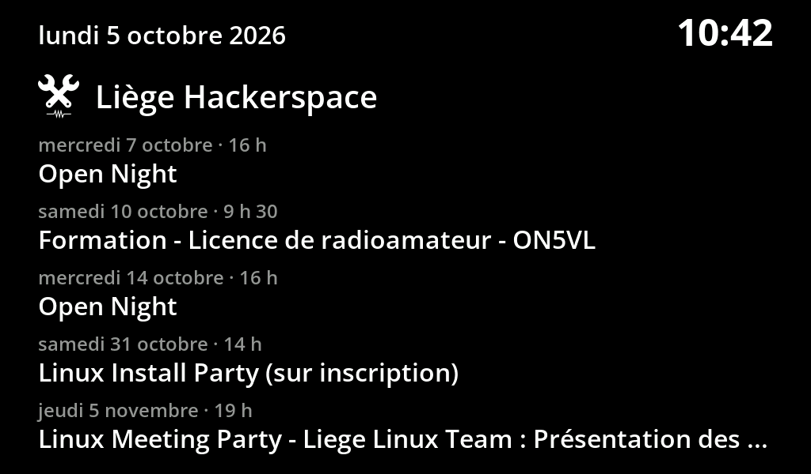
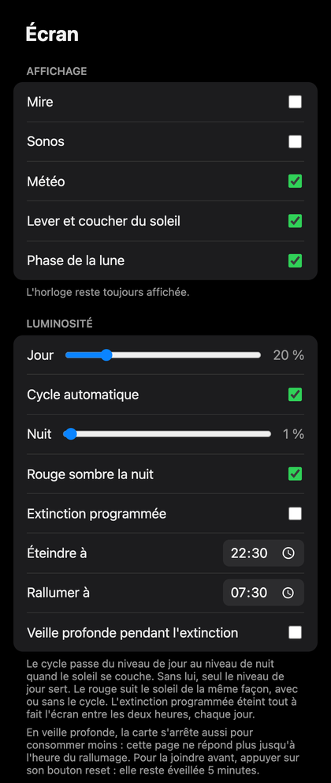

# Écran d'accueil pour Waveshare ESP32-S3-LCD-5B

Une horloge de salon sur un écran de 5 pouces (1024 × 600), qui fait défiler quelques pages utiles et se règle depuis une page web servie par la carte. Le firmware est écrit pour PlatformIO, sans bibliothèque externe.



## Les pages

| | |
| :---: | :---: |
| <br>**Accueil, la nuit** | <br>**Sonos** |
| <br>**Cryptomonnaies** | <br>**Agendas personnels** |
| <br>**Agenda du hackerspace** | <br>**Back office** |

- **Accueil** : heure et date, météo des six heures à venir avec annonce de pluie, lever et coucher du soleil, phase de la lune, nombre de personnes dans l'espace. Chaque élément se désactive, et la page se recentre.
- **Sonos** : le morceau en cours quand une enceinte du réseau joue. La carte interroge les enceintes directement, sans compte ni cloud. La pochette est celle que l'enceinte annonce pour le morceau : la carte la télécharge sur le serveur d'images de Spotify, en 300 × 300. Un morceau venu d'une autre source (radio, bibliothèque locale) s'affiche sans pochette.
- **Cryptomonnaies** : le cours en euros de six cryptos au plus, leurs variations sur 1 heure, 24 heures et 7 jours, et la valeur du portefeuille si des quantités sont saisies. Ces cours sont donnés à titre purement informatif : ils peuvent être en retard ou inexacts, et ne constituent ni un conseil ni une base pour une décision d'achat ou de vente.
- **Agendas personnels** : les dix prochains événements de trois calendriers au plus, donnés par leur adresse iCal (Google Agenda, par exemple).
- **Agenda du hackerspace** : les cinq prochains événements du [Liège Hackerspace](https://lghs.be).

Les pages activées se succèdent en diaporama, chacune pendant sa durée, avec un fondu en option. Sonos peut aussi garder l'écran pour elle tant que la musique joue.

La nuit, la luminosité suit le soleil de la ville choisie. En option, les couleurs virent au rouge sombre, et l'écran s'éteint entre deux heures, avec ou sans mise en veille profonde de la carte.

*Les images de l'écran sont des rendus calculés avec les polices et les couleurs de la carte, pas des photos.*

## Le back office

La carte sert une page de réglages sur son adresse (`http://<adresse>/`, affichée sur le port série au démarrage). Tout s'y règle : pages et durées, contenu de l'accueil, cryptos, agendas, luminosité, lieu de la météo. Chaque réglage est enregistré dès qu'il change. La page donne aussi l'état de la carte et permet de la redémarrer ou de lui envoyer un nouveau firmware.

Deux précautions :

- La page n'a pas de mot de passe : elle est faite pour rester sur le réseau local. Les quantités de cryptomonnaies y sont visibles.
- L'adresse secrète d'un agenda privé donne accès à tout l'agenda. Elle est gardée sur la carte et n'est plus jamais affichée, mais la carte ne vérifie pas le certificat du serveur qu'elle interroge.

## Installation

Il faut une [Waveshare ESP32-S3-LCD-5B](https://www.waveshare.com/wiki/ESP32-S3-Touch-LCD-5), version sans tactile, et [PlatformIO](https://platformio.org).

1. Copier `include/secrets.example.h` en `include/secrets.h` et y mettre le nom et le mot de passe du Wi-Fi.
2. Brancher la carte en USB, puis compiler et flasher :

   ```sh
   pio run -t upload
   ```

3. Ouvrir le back office pour choisir la ville et les pages.

Les mises à jour suivantes peuvent passer par le Wi-Fi, depuis le back office ou en ligne de commande :

```sh
pio run
curl -H Expect: --data-binary @.pio/build/waveshare-5b/firmware.bin http://<adresse>/update
```

## Pour aller plus loin

<details>
<summary>Ce que la carte demande au réseau, et à quel rythme</summary>

| Donnée | Service | Rythme | Après un échec | Condition |
| --- | --- | --- | --- | --- |
| Heure | `pool.ntp.org` (NTP) | à chaque connexion au Wi-Fi, puis toutes les 3 heures | géré par le SDK | toujours |
| Météo et fuseau horaire | `api.open-meteo.com` (HTTP) | 15 minutes | 1 minute | toujours : elle donne le fuseau |
| Cours des cryptomonnaies | `api.coingecko.com` (HTTPS) | 2 minutes | 1 minute | si une crypto est choisie |
| Agenda du hackerspace | `lghs.be` (HTTPS) | 1 heure | 10 minutes | toujours |
| Agendas personnels | les adresses données (HTTPS) | 1 heure, chacun | 10 minutes | pour chaque adresse |
| Personnes dans l'espace | `corquaid.github.io` (HTTPS) | 6 heures | 10 minutes | si la case est cochée |
| État des enceintes Sonos | réseau local, port 1400 | 2 secondes en lecture, 5 sinon | à la lecture suivante | toujours |
| Recherche des enceintes | réseau local (SSDP) | 10 minutes | à la lecture suivante | toujours |
| Pochette du morceau | `i.scdn.co` (HTTP) | à chaque changement de pochette | pas de pochette | en lecture |

- Après un démarrage, les lectures en HTTPS attendent 30 à 40 secondes, puis passent une à la fois.
- Une donnée trop ancienne n'est plus affichée : la météo après 90 minutes, les cours après 20 minutes, un agenda après 48 heures.
- Les agendas et les cours sont lus même si leur page est désactivée.
- Les recherches de ville et de cryptomonnaie du back office partent du navigateur, pas de la carte.
- Les cours demandés ne contiennent pas les quantités : elles ne quittent pas la carte.

</details>

<details>
<summary>Organisation du code</summary>

| Fichier | Rôle |
| --- | --- |
| `src/lcd.cpp` | Pilote de la dalle RGB : échange d'images sans déchirement, lignes gardées en RAM interne, fondu |
| `src/gfx.cpp` | Dessin et texte antialiasé, teinte de nuit |
| `src/plugin.cpp`, `src/plugins/` | Pages et diaporama |
| `src/weather.cpp`, `src/astro.cpp`, `src/space.cpp` | Météo et fuseau horaire, soleil et lune, personnes dans l'espace |
| `src/sonos.cpp` | Enceintes Sonos du réseau local |
| `src/crypto.cpp` | Cours des cryptomonnaies |
| `src/agenda.cpp`, `src/ical.cpp` | Agendas : lecture des calendriers au fil de l'eau, récurrences comprises |
| `src/brightness.cpp` | Luminosité, cycle, extinction et veille profonde |
| `src/web.cpp` | Back office et mise à jour par Wi-Fi |
| `tools/` | Génération des polices, des pictogrammes et du logo |

Une contrainte guide tout le reste : pendant que le Wi-Fi travaille, l'écran ne peut lire sans saut d'image que la RAM interne de la puce, qui est petite. Chaque ligne affichée y est donc gardée sous forme compacte, limitée à 16 couleurs. Une page nouvelle doit s'y tenir : un fond et un texte d'une seule couleur par ligne, ou jusqu'à trois couleurs avec un lissage réduit, comme sur la page crypto.

Pour la même raison, la mémoire des connexions chiffrées et les piles des tâches réseau sont placées en PSRAM.

</details>

## Crédits

Le pilote d'écran, le dessin, le rendu du texte et les pictogrammes météo sont écrits pour ce projet : aucune bibliothèque externe n'est déclarée dans `platformio.ini`. Ce que le projet utilise ou reprend d'ailleurs :

<details>
<summary>Dans le firmware</summary>

| Quoi | Auteur | Licence | Utilisation |
| --- | --- | --- | --- |
| [Arduino core pour ESP32](https://github.com/espressif/arduino-esp32) 3.3.12 | Espressif Systems | LGPL-2.1 | Framework : série, I2C, Wi-Fi, réglages en flash, mise à jour par Wi-Fi, HTTPS |
| [ESP-IDF](https://github.com/espressif/esp-idf) 5.5.5 | Espressif Systems | Apache-2.0 | Pilote LCD RGB `esp_lcd`, heure réseau, et les composants embarqués (FreeRTOS, lwIP, mbedTLS...) |
| [Open Sans](https://github.com/googlefonts/opensans) 3.003 | The Open Sans Project Authors, © 2020 | SIL Open Font License 1.1 ([texte](include/fonts/OFL.txt)) | Glyphes pré-rendus dans `include/fonts/` |
| [Logo du Liège Hackerspace](https://github.com/LgHS/branding) | LgHS | GPL-3.0 | Pictogramme de la page agenda (`include/fonts/font_lghs56.h`) |
| [TJpgDec](http://elm-chan.org/fsw/tjpgd/) | ChaN | Licence libre de l'auteur (type BSD) | Décodeur JPEG de la ROM de l'ESP32-S3, pour les pochettes |

</details>

<details>
<summary>Outils de build</summary>

| Quoi | Auteur | Licence | Utilisation |
| --- | --- | --- | --- |
| [PlatformIO](https://platformio.org) | PlatformIO Labs | Apache-2.0 | Compilation et téléversement |
| [pioarduino platform-espressif32](https://github.com/pioarduino/platform-espressif32) 55.03.312 | Communauté pioarduino | Apache-2.0 | Plateforme PlatformIO fournissant l'Arduino core 3.x |
| [Pillow](https://python-pillow.github.io) | Jeffrey A. Clark et contributeurs | MIT-CMU | Rendu des polices, des pictogrammes et du logo par les scripts de `tools/` (pas embarqué dans le firmware) |

</details>

<details>
<summary>Services utilisés à l'exécution</summary>

| Service | Utilisation |
| --- | --- |
| [NTP Pool Project](https://www.ntppool.org) | Heure réseau |
| [Open-Meteo](https://open-meteo.com), données sous licence CC BY 4.0, usage non commercial sans clé | Météo et fuseau horaire ; recherche de ville, appelée par le navigateur depuis le back office |
| [CoinGecko](https://www.coingecko.com), accès public sans clé | Cours des cryptomonnaies ; recherche d'une crypto, appelée par le navigateur |
| [International Space Station APIs](https://github.com/corquaid/international-space-station-APIs), liste tenue à jour par son auteur | Nombre de personnes dans l'espace |
| Calendrier public du [Liège Hackerspace](https://lghs.be) | Événements de la page agenda |
| Enceintes Sonos du réseau local (UPnP) | Morceau en cours |
| Serveur d'images de Spotify | Pochette du morceau en cours |

</details>

<details>
<summary>Sources et références</summary>

Rien n'est copié tel quel de ces projets, mais le code s'appuie dessus.

- **Wiki Waveshare de la carte ESP32-S3-Touch-LCD-5 / 5B** : brochage, schéma, CH422G.
- **[ESP32_Display_Panel](https://github.com/esp-arduino-libs/ESP32_Display_Panel)** (Espressif, Apache-2.0) : broches et timings de départ de la dalle, repris dans `include/board_pins.h`.
- **[Arduino_GFX](https://github.com/moononournation/Arduino_GFX)** (Moon On Our Nation) : utilisée par la première version du projet. Les paramètres `esp_lcd` de `src/lcd.cpp` reprennent ceux de sa classe `Arduino_ESP32RGBPanel`.
- **Source d'ESP-IDF, `esp_lcd_panel_rgb.c`** : l'échange d'images sans déchirement repose sur le comportement de `lcd_rgb_panel_fill_bounce_buffer()`, et le choix du tampon dans `src/lcd.cpp` contourne un défaut de `lcd_rgb_panel_eof_handler()`.
- **[SoCo](https://github.com/SoCo/SoCo)** et **[sonos.svrooij.io](https://sonos.svrooij.io/)** : documentation communautaire du protocole UPnP des enceintes Sonos.
- **[Algorithmes de dates de Howard Hinnant](https://howardhinnant.github.io/date_algorithms.html)** (domaine public) : passage d'une date à un nombre de jours, dans `src/ical.cpp`.
- **[Astronomy Answers, « Position of the Sun »](https://www.aa.quae.nl/en/reken/zonpositie.html)** (Louis Strous) : hauteur du soleil, heures de lever et de coucher, dans `src/astro.cpp`.
- **Jean Meeus, *Astronomical Algorithms*** : arguments moyens de la lune et ses principales inégalités, repris à l'ordre le plus bas pour la phase de la lune.
- **Algorithme de Bresenham** pour le tracé de lignes, et **mélange RGB565 en une multiplication** (masque `0x07E0F81F`, astuce classique sans auteur identifié) pour l'antialiasing du texte.

</details>

Code écrit avec l'assistance de [Claude Code](https://claude.com/claude-code) (Anthropic).
